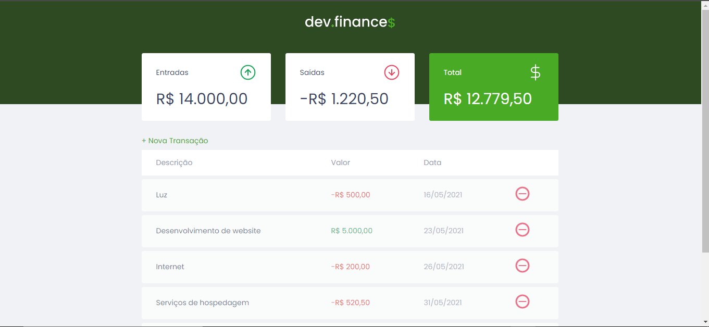
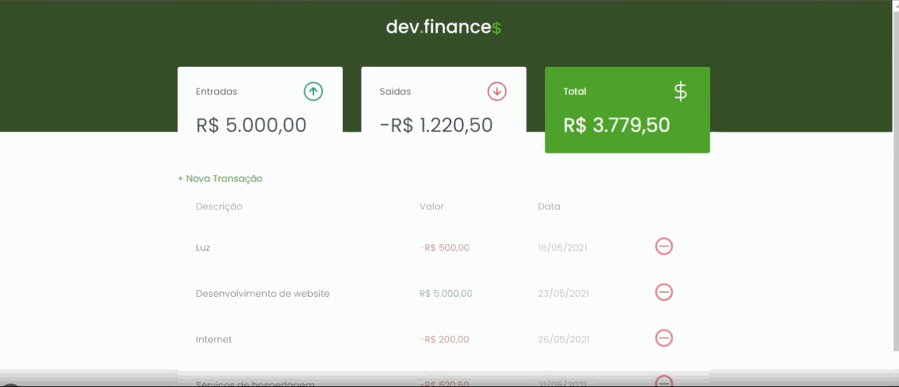

<div align="center">
  
</div>

<br>
<br>

<div align="center">	
   <a href="www.linkedin.com/in/eloilsondosanjosrocha">
      
   </a>
  

  <a href="https://github.com/eloilsondosanjos/DevFinancas-MaratonaDiscovery01/commits/master">
    
  </a> 
  
  <a href="https://github.com/eloilsondosanjos/DevFinancas-MaratonaDiscovery01/stargazers">
    
  </a>
</div>

<br>

<div align="center">
  <a href="#rocket-tecnologias">Tecnologias</a>&nbsp;&nbsp;&nbsp;|&nbsp;&nbsp;&nbsp;
  <a href="#-projeto">Projeto</a>&nbsp;&nbsp;&nbsp;|&nbsp;&nbsp;&nbsp;
  <a href="#-layout">Layout</a>&nbsp;&nbsp;&nbsp;|&nbsp;&nbsp;&nbsp;
  <a href="#memo-licença">Licença</a>
</div>

<br>

## Designer Moderno

<br>

<div align="center">

  
</div>
<br>

## Veja Alguns funcionalidades

<br>

<div align="center">

  
</div>

<br>

## Detalhes na responsividade

<div align="center">

  
</div>

<br>

## 💻 O que é o DevFinança$

<br>

É uma aplicação desenvolvida para facilitar o controle das finanças de nós dezenvolvedores.

<br>

## 🚀 Tecnologias utilizadas

<br>

Projeto foi desenvolvido com as seguintes tecnologias:

- [HTML5](https://developer.mozilla.org/pt-BR/docs/Learn/HTML/Introduction_to_HTML)
- [CSS](https://developer.mozilla.org/pt-BR/docs/Learn/CSS/First_steps)
- [Java Script](https://developer.mozilla.org/pt-BR/docs/Web/JavaScript/Guide/Introduction)

<br>

## 📦 Como Baixar e Executar o Projeto:

```bash

  # Primeiro clone o repositório para sua maquina

  $ git clone https://github.com/eloilsondosanjos/DevFinancas-MaratonaDiscovery01.git

  # Acesse a pasta do projeto:

  cd DevFinancas-MaratonaDiscovery01

  # Instale a extensão Live Server no seu VSCode
  # Clique com o botão direito no arquivo index.html
  # Nas opções exibidas clique em Open with Live Server


## 📟 Layout

Você pode ver o layout detalhado através do figma caso tenha uma conta.
[nesse link](https://www.figma.com/file/jafca2ljPxIJUtQOLGXctq/dev.finance-Maratona-Discover-Copy?fuid=851206829887265816)


## 📋 Licença

Esse projeto está sob a licença MIT. Veja o arquivo [LICENSE](LICENSE.htm) para mais detalhes.


---

Desenvolvido por Eloilson dos Anjos
```
